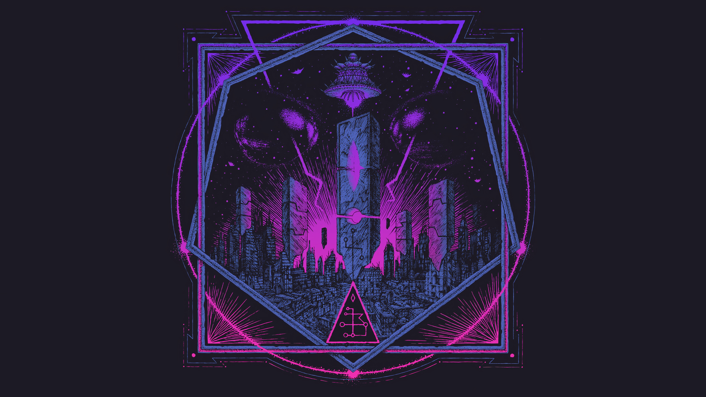

# Tokyo Night Wallpapers for Omarchy

A curated set of wallpapers themed around the Tokyo Night palette for Omarchy.

## Gallery

<table>
  <tr><td width="220" align="center"><br><sub>cyber-dock-mech.jpg</sub></td><td width="220" align="center"><br><sub>neon-cyber-skeleton.jpg</sub></td><td width="220" align="center"><br><sub>roadtrip-cloudburst.png</sub></td></tr>
  <tr><td width="220" align="center"><br><sub>sunset-mountain-hike.png</sub></td><td width="220" align="center"><br><sub>neon-gas-station.jpg</sub></td><td width="220" align="center"><br><sub>lakeside-sunset-town.png</sub></td></tr>
  <tr><td width="220" align="center"><br><sub>lone-tree-lake.jpg</sub></td><td width="220" align="center"><br><sub>aurora-lake-glow.jpg</sub></td><td width="220" align="center"><br><sub>neon-city-aerial.jpg</sub></td></tr>
  <tr><td width="220" align="center"><br><sub>noir-hologram-girl.jpg</sub></td><td width="220" align="center"><br><sub>eva-mecha-stare.jpg</sub></td><td width="220" align="center"><br><sub>sunset-balloon-desert.jpg</sub></td></tr>
  <tr><td width="220" align="center"><br><sub>violet-gaze-girl.png</sub></td><td width="220" align="center"><br><sub>moon-arch-staircase.jpg</sub></td><td width="220" align="center"><br><sub>neon-wire-cat.jpg</sub></td></tr>
  <tr><td width="220" align="center"><br><sub>occult-wheel-neon.jpg</sub></td><td width="220" align="center"><br><sub>neon-portal-sigil.jpg</sub></td><td width="220" align="center"><br><sub>neon-city-signs.jpg</sub></td></tr>
  <tr><td width="220" align="center"><br><sub>sakura-glow-trees.jpg</sub></td><td width="220" align="center"><br><sub>prism-cloud-neon.jpg</sub></td><td width="220" align="center"><br><sub>skull-glitch-profile.jpg</sub></td></tr>
  <tr><td width="220" align="center"><br><sub>neon-karaoke-alley.jpg</sub></td><td width="220"></td><td width="220"></td></tr>
</table>
## Install

Clone the repo, then open Omarchy's background installer and import the wallpapers from the cloned folder.

```bash
git clone https://github.com/OldJobobo/omarchy-tokyo-night-bg-addon.git
```

1. Open the installer:
   - `omarchy-theme-bg-install`

   or

   - Omarchy Menu >
     Install > Style > Background
2. When the folder opens, drag wallpapers from your cloned `omarchy-tokyo-night-bg-addon` folder into it.

## Contributing Wallpapers

Want to add your own Tokyo Night themed wallpaper? We'd love your contribution! Here's a simple step-by-step guide:

### Step 1: Fork the Repository
1. Click the **Fork** button at the top right of this page
2. This creates your own copy of the repository

### Step 2: Upload Your Wallpaper

#### Option A: Using GitHub's Website (Easiest!)
1. Go to **your forked repository** (it will be at `https://github.com/YOUR-USERNAME/omarchy-tokyo-night-bg-addon`)
2. Click **Add file** → **Upload files**
3. Drag and drop your wallpaper image(s) or click to browse
4. Give your wallpaper a descriptive filename (e.g., `neon_city_skyline.jpg`)
5. Scroll down and click **Commit changes**

#### Option B: Using Git (If you're comfortable with command line)
1. Clone your forked repository:
```bash
git clone https://github.com/YOUR-USERNAME/omarchy-tokyo-night-bg-addon.git
cd omarchy-tokyo-night-bg-addon
```
2. Copy your wallpaper file into the repository folder
3. Add and commit your changes:
```bash
git add your-wallpaper-name.jpg
git commit -m "Add new wallpaper: your-wallpaper-name.jpg"
git push
```

### Step 3: Submit a Pull Request
1. Go back to **your forked repository** on GitHub
2. Click the **Contribute** button, then **Open pull request**
3. Add a brief description of your wallpaper
4. Click **Create pull request**

That's it! I'll review your submission and merge it if it fits the Tokyo Night theme. 

### Wallpaper Guidelines
- **Theme**: Should match the Tokyo Night color palette (purples, blues, pinks, neon accents)
- **Format**: JPG or PNG
- **Resolution**: 2560x1440 minimum
- **Filename**: Use descriptive, lowercase names with underscores (e.g., `cyberpunk_street.jpg`)

Thank you for contributing! 🌃✨
